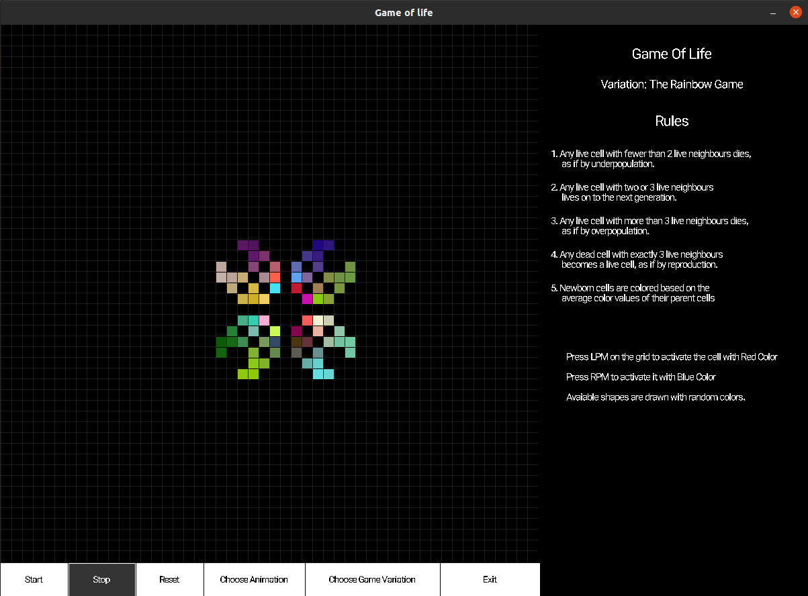

# Visualization of Game of Life in Lua and Love2D

### Game of life rules
1. Any live cell with fewer than 2 live neighbours dies, as if by underpopulation.

2. Any live cell with two or 3 live neighbours lives on to the next generation.

3. Any live cell with more than 3 live neighbours dies, as if by overpopulation.

4. Any dead cell with exactly 3 live neighbours becomes a live cell, as if by reproduction

## The application inclucdes other variations of the Game of life

* <b>Life</b> - Basic variation

* <b>HighLife</b> - Last rules changes, any dead cell with exactly 3 or 6 live neighbours becomes a live cell.

* <b>The Rainbow Game</b> - Additional rule, newborn cells are colored based on the average color values of their parent cells.

## User interactions

The user can infulence the flow of the animation by changing status of the cell or the color.

LPM - Activate cell with the red color

RPM - Activate cell with the blue color

Click on the active will will make it inactive

## Snapshots

## **UI Snapshot**

## **UI Dropdowns**

## **UI Pulsar**

## **Lightship Snapshot**

## **Pulsar Rainbow Stage 1**

## **Pulsar Rainbow Stage 2**

